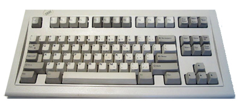

Nostalgia bucklespring keyboard sound
=====================================

This project emulates the sound of my old faithful IBM Model-M space saver
bucklespring keyboard while typing on my notebook, mainly for the purpose of
annoying the hell out of my coworkers.



Bucklespring runs as a background process and plays back the sound of each key
pressed and released on your keyboard, just as if you were using an IBM
Model-M. The sound of each key has carefully been sampled, and is played back
while simulating the proper distance and direction for a realistic 3D sound
palette of pure nostalgic bliss.

Installation
------------

### Linux

To compile on debian-based linux distributions, first make sure the require
libraries and header files are installed, then simply run `make`:

````
$ sudo apt-get install libopenal-dev libalure-dev libxtst-dev
$ make
$ ./buckle
````

### MacOS

I've heard rumours that bucklespring also runs on MacOS. I've been told that
the following should do:

```
$ brew install alure
$ make
```

I was also told the following: "You need superuser privileges to create the
event tap, unless accessibility is enabled. To do so, select the "Enable access
for assistive devices" checkbox in the Universal Access system preference
pane."

Please let me know if this works for you, because I'm not able to test this
myself due to lack of hardware.


### Windows

(The windows build is currently broken, it seems that switching from freelut to
alure broke windows, I might fix this one day...)

For windows the binary is provided in `buckle.exe`. To run on windows,
make sure to first install OpenAL from the official package at
https://www.openal.org/downloads/. 

The source can be cross-compiled from linux using the MinGW compiler:

````
$ make mingw=1
$ buckle.exe
````

The program is launched in the background, and has no user interface whatsoever.
To terminate, find 'buckle.exe' in the task manager and kill. Any volunteers
for implementing a systray icon?

Usage
-----

````
usage: ./buckle [options]

options:

  -d DEVICE use OpenAL audio device DEVICE
  -g GAIN   set playback gain [0..100]
  -h        show help
  -l        list available openAL audio devices
  -p PATH   load .wav files from directory PATH
  -s WIDTH  set stereo width [0..100]
  -v        increase verbosity / debugging
````

OpenAL notes
------------

Bucklespring uses the OpenAL library for mixing samples and providing a
realistic 3D audio playback. The default OpenAL settings can cause a slight
delay in playback. Edit or create the OpenAL configuration file `~/.alsoftrc`
and add the following options:

````
period_size = 32
periods = 4
````

If you are using headphones, enabling the head-related-transfer functions in
OpenAL for a better 3D sound:

````
hrtf = true
````
